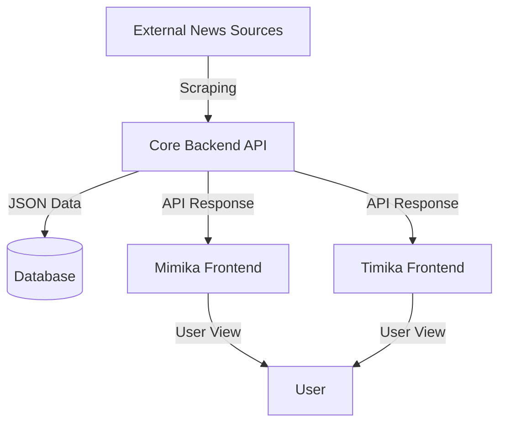

# Papua News - Project Documentation

## 1. Overview & Architecture

Papua News adalah ekosistem berita terintegrasi yang melayani wilayah Mimika dan Timika. Project ini terdiri dari tiga komponen utama:

### 🏗️ Komponen Project

| Component | Directory | Description | Technology |
|-----------|-----------|-------------|------------|
| **Core Backend** | `mimika_timika_core/services/backend-service` | Pusat data, API, dan Scraping Engine | Python (FastAPI), SQLAlchemy |
| **Mimika Web** | `mimika_landing_page` | Portal berita khusus region Mimika | React (Vite, TypeScript) |
| **Timika Web** | `timika_landing_page` | Portal berita khusus region Timika | React (Vite, TypeScript) |

### 🔄 Architecture Diagram


---

## 2. Data Flow & Integration

### 🔗 API Connectivity
Frontend terhubung ke backend melalui REST API yang di-host di Vercel (Production) atau Localhost (Development).

*   **Base URL (Prod)**: `https://papuanews-engine.vercel.app`
*   **Base URL (Dev)**: `http://localhost:8000`

### 📡 Data Fetching Strategy
Frontend menggunakan service layer (`src/services/api.ts`) untuk mengambil dan menormalisasi data dari backend.

#### 1. Fetching News List
**Endpoint**: `GET /articles`
**Parameters**:
*   `region`: "mimika" atau "timika" (Filter utama)
*   `category`: Optional category filter
*   `limit`: Jumlah berita (default: 50)

**Frontend Implementation (`api.ts`):**
```typescript
const fetchNews = async (region, category) => {
    // 1. Construct URL with query params
    const response = await fetch(`${API_BASE_URL}/articles?region=${region}`);
    const json = await response.json();
    
    // 2. Normalize Data for UI
    return json.map(item => ({
        id: item.id,
        title: item.title,
        summary: item.summary,
        image: item.image_url || "/placeholder.svg", // Fallback image
        date: formatDate(item.published_at),      // Formatting date
        url: item.source_url                      // Original link
    }));
}
```

---

## 3. UI Data Dictionary

Data yang ditampilkan di antarmuka pengguna (UI) berasal langsung dari hasil normalisasi Fetch API.

### 🖼️ News Card Component
Component: `NewsCard.tsx`
Menampilkan ringkasan berita di halaman utama.

| UI Element | Source Field (Backend) | Frontend Map | Description |
|------------|------------------------|--------------|-------------|
| **Banner Image** | `image_url` | `image` | Gambar utama berita. Menggunakan placeholder jika null. |
| **Title** | `title` | `title` | Judul berita (max 2 baris). |
| **Date** | `published_at` | `date` | Tanggal terbit diformat (e.g., "20 Januari 2026"). |
| **Description** | `summary` | `summary` | Ringkasan/excerpt singkat konten (max 3 baris). |
| **"Baca Selengkapnya"** | `source_url` | `url` | Link eksternal ke sumber asli (Detik, Kompas, dll). |

### 📄 Article Detail Page (Internal)
Component: `ArticleDetail.tsx` (Jika klik detail internal)

| UI Element | Source Field | Description |
|------------|--------------|-------------|
| **Category** | `category` | Kategori berita (Politik, Sosial, dll). |
| **Source** | `source_name` | Nama media asal (e.g., "Detik"). |
| **Full Content** | `content` | Isi lengkap berita (jika discrape penuh). |

---

## 4. Backend Data Structure

### 🐍 Python Data Model (FastAPI)
Model utama yang digunakan di `mimika_timika_core`.

```python
class Article(BaseModel):
    id: int
    title: str
    summary: str
    content: Optional[str]
    image_url: Optional[str]
    source_url: str        # Unique Identifier for deduplication
    source_name: str       # e.g., "detik", "kompas"
    category: str          # Normalized category
    region: str            # "mimika", "timika", or "general"
    published_at: datetime
    created_at: datetime
```

### 🌍 Regional Filtering Logic
Backend memiliki logika isolasi data berdasarkan parameter `region`.

*   **Request**: `GET /articles?region=mimika`
    *   **Logic**: `WHERE region = 'mimika' OR region = 'general'` AND `region != 'timika'`
*   **Request**: `GET /articles?region=timika`
    *   **Logic**: `WHERE region = 'timika' OR region = 'general'` AND `region != 'mimika'`

---

## 5. Setup & Configuration Differences

Kedua frontend Project (`mimika` dan `timika`) identik secara struktur kode, perbedaannya hanya pada file konfigurasi:

| Configuration | Mimika Landing Page | Timika Landing Page |
|---------------|---------------------|---------------------|
| **Package Name** | `@undercover/web-mimika` | `@undercover/web-timika` |
| **Port** | `8080` | `8081` |
| **Site Config** | `region: "mimika"` | `region: "timika"` |
| **Config File** | `src/config/site.ts` | `src/config/site.ts` |

---

## 6. API Endpoints Reference

### Public API (`/public/v1/*` or direct `/articles`)

*   **`GET /articles`**
    *   Returns list of latest news.
    *   Query Params: `limit`, `region`, `category`.
*   **`GET /articles/{id}`**
    *   Returns single article detail.
*   **`POST /ingest/run`** (Admin/Cron)
    *   Triggers the scraping engine manually.
    *   Requires `x-api-key` header.